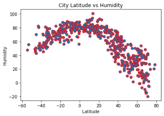
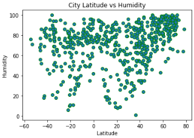
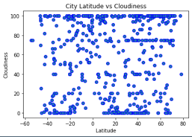
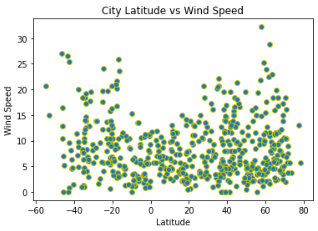
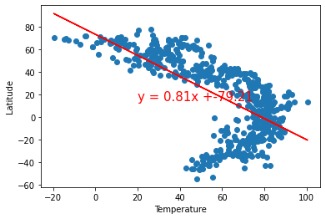
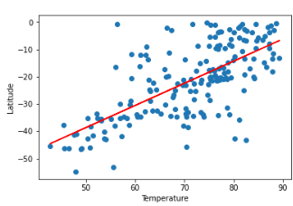

# Weather Analysis

This Python script uses the OpenWeatherMap API to analyze the weather of 500+ cities across the world with varying distance from the equator. The purpose of the analysis is to find the relationship between latitude and various weather variables such as temperature, humidity, cloudiness, and wind speed.

## Dependencies

Before running the script, ensure that you have the following:

* Python 3.6 or later
* pandas
* numpy
* matplotlib
* requests
* citipy
* API key from OpenWeatherMap

## Usage

1. Obtain an API key from OpenWeatherMap and store it in `api_keys.py` as `weather_api_key`.
2. Run the script to generate a list of cities and their weather data, which will be saved to a CSV file named `cities.csv` in the `output_data` folder.
3. Scatter plots will be generated and saved as PNG files in the `output_data` folder.

   
4. Linear regression analyses will be performed on the data and visualized in scatter plots.

   Results of `Temperature` vs `Latitude` for all datapoints.

   ```
   The r-value is: 0.436470
   ```

   

   Results of `Temperature` vs `Latitude` for Northern Hemisphere

   ```
   The r-value is: 0.742736
   ```

   

    Results of`Temperature` vs `Latitude` for Southern Hemisphere

```
The r-value is: 0.469182
```

    


## Results

The script generates scatter plots that showcase the relationship between weather variables and latitude, and computes the linear regression for each relationship. The output plots and CSV file can be found in the `output_data` folder.

---

# Vacation Map

Displays a heatmap of cities around the world based on their humidity levels and finds ideal vacation spots with specific weather conditions. The code then finds the nearest hotel for each city using the Geoapify API and displays the information on a map with markers.

## Dependencies

* Same dependencies as above
* hvplot.pandas

## Usage

1. Import the required libraries and API keys and save them to file called `api_keys.py`. Esure to add this file to your gitignore to protect your API key.
2. Load the `cities.csv` file into a DataFrame.
3. Create a map displaying a point for each city in the DataFrame. The size of the point represents the humidity in each city.
4. Narrow down the cities based on ideal weather conditions (max temperature between 65 and 75 degrees, wind speed below 5 mph, and cloudiness below 30%).
5. Create a new DataFrame called `hotel_df` containing the city, country, coordinates, and humidity for the selected cities.
6. For each city, use the Geoapify API to find the first hotel located within 10,000 meters of the coordinates. Store the hotel name in the `hotel_df` DataFrame.
7. Add the hotel name and country as additional information in the hover message for each city in the map.

## Results

The output will be a map with markers indicating the location of each ideal vacation city. The markers will have a hover message displaying the hotel name and country.
